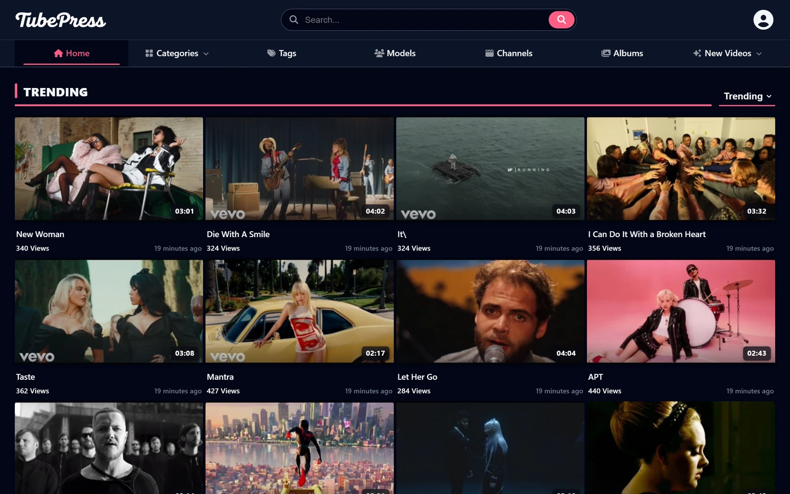

# TubePress — Free, Self‑Hosted Adult Tube Site CMS

**TubePress** is a complete, free CMS for building and running self‑hosted adult tube sites: video management with FFmpeg transcoding, bulk import, memberships, ad zones, SEO tooling and a licensed content catalogue — on a plain PHP + MySQL stack you fully control. No ionCube, no encoded files, no framework, no Node.js build step.

> **Name note:** this project is **not affiliated** with the legacy "TubePress" WordPress/YouTube gallery plugin (tubepress.com, 2006‑era). This TubePress is a standalone, self‑hosted CMS for adult video sites, published at **[tubepress.io](https://tubepress.io)**.

**[Website](https://tubepress.io)** · **[Live demo](https://demo.tubepress.io)** · **[Download](https://tubepress.io/download)** · **[Documentation](https://tubepress.io/documentation)** · **[Guides](https://tubepress.io/guides)** · **[Compare](https://tubepress.io/compare)** · **[Changelog](https://tubepress.io/changelog)**

## Why TubePress

- **Video pipeline built in** — FFmpeg transcoding with admin‑defined formats and renditions, poster thumbnails, animated hover previews, optional watermark and intro burn‑ins, multi‑server storage.
- **Licensed content catalogue** — over a million licensed items (540k+ videos, 560k+ photo galleries) available for one‑click, per‑item import, so a new site is never empty.
- **Bulk import** — CSV/JSON feeds with mapping, scheduling and safe re‑runs.
- **Ad system built in** — dozens of placement zones across pages and player (VAST‑compatible video slots), managed from the admin.
- **Member accounts** — registration, favorites, watch history and comments: the audience layer, on your own domain.
- **Native CTR ranking** — impressions and clicks measured per video and fed back into listing order; no external recommendation service required.
- **SEO by default** — VideoObject / BreadcrumbList schema, XML sitemaps, hreflang, clean canonical URLs, server‑rendered HTML.
- **Multilingual** — 30 interface languages shipped; per‑entity translation tooling, with optional AI translation for tags and categories.
- **Photo galleries & albums** — first‑class image content type alongside video.
- **Compliance tooling** — Age Gate plugin (multiple modes, RTA labeling), per‑video reporting with a moderation queue, editable legal pages, role‑based admin/moderator accounts.
- **Themes & plugins** — theme API and plugin system, with readable PHP throughout.
- **Optional AI add‑ons** — credit‑priced descriptions and metadata translation on top of the free core.
- **Self‑hosted, portable, yours** — plain PHP 8.2+ and MySQL/MariaDB; install with a 5‑step web wizard in about five minutes.

## Requirements

| Component | Minimum |
|---|---|
| PHP | **8.2+** (built for 8.4, strict types) with PDO, mbstring, json, curl, fileinfo |
| Database | MySQL 5.7+ or MariaDB 10.4+ |
| Web server | Apache (mod_rewrite) or nginx |
| Media | FFmpeg for transcoding, thumbnails and previews |

## Install in five minutes

1. Download the ZIP from [tubepress.io/download](https://tubepress.io/download) and upload it to your server.
2. Create an empty MySQL database and user.
3. Open your domain — the 5‑step web installer starts automatically.
4. Enter database details, create your admin account, pick site name and language.
5. Import content (CSV/JSON or the built‑in catalogue) and go live.

Full walkthrough: [documentation](https://tubepress.io/documentation) · [how to start an adult tube site](https://tubepress.io/guides/how-to-start-an-adult-tube-site).

## Pricing & license

- The **core CMS is free**, for unlimited sites of your own — no trials, no feature gates, no per‑domain fees.
- Optional paid add‑ons (premium theme, AI features, licensed catalogue credits) are sold on the [marketplace](https://tubepress.io).
- TubePress is **source‑available, not open‑source**: the PHP you deploy is fully readable and auditable, but the software remains proprietary and may not be redistributed or resold. See [LICENSE](LICENSE.md) and the [terms](https://tubepress.io/terms).

## FAQ

**Is it really free?** Yes — the full core, for your own sites, without limits on videos or domains. Paid items are optional add‑ons.

**Is it open source?** No. The code is readable PHP (no ionCube, nothing encoded), which is why we say *source‑available* — but it is proprietary software, not OSI open source, and this repository is a publishing mirror rather than a development tree.

**Does it come with content?** Optionally: the built‑in catalogue offers licensed videos and galleries for per‑item import. Bring‑your‑own‑content workflows (uploads, feeds, sponsors) are fully supported — see [where to get content](https://tubepress.io/guides/get-content-for-tube-site).

## Contributing & support

This repository is a **read‑only mirror** for releases and documentation pointers. Issues and discussions are disabled, and **pull requests are closed automatically** — see [CONTRIBUTING](CONTRIBUTING.md). For questions or support, use [tubepress.io/contact](https://tubepress.io/contact). Security reports: see [SECURITY](SECURITY.md).

## Legal

TubePress is professional software for the legal adult industry. Operators are responsible for compliance in their jurisdictions (age verification, 18 U.S.C. 2257 record‑keeping, DMCA/NCII takedown duties, and similar). The CMS ships the supporting surfaces — age gating, reporting and moderation queues, editable legal pages — and the [guides](https://tubepress.io/guides) cover the operational side in depth. Intended for lawful use by adults (18+).

---

© TubePress — [tubepress.io](https://tubepress.io)
